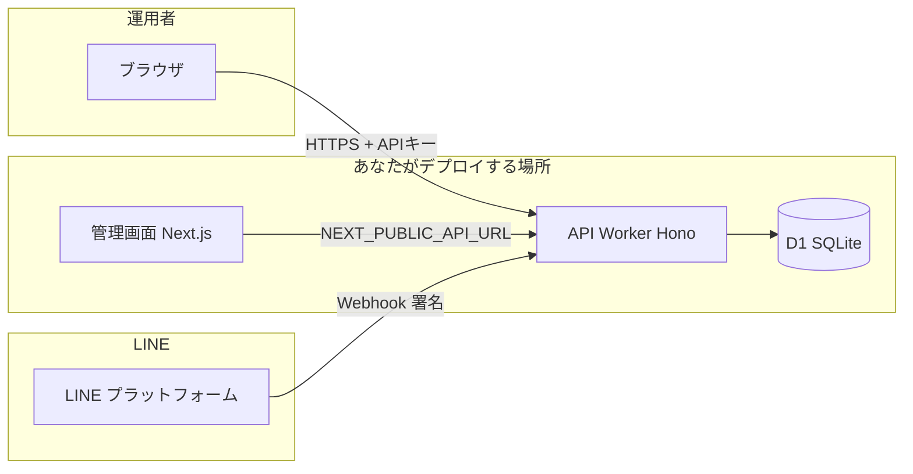

# LINE Harness システム仕様書

## 1. 文書の目的

**LINE Harness** が「何のためのシステムで、誰が、何をできるか」を文章だけで把握できるようにします。専門用語は初出で短く説明します。

---

## 2. システム概要（ひとことで）

LINE の**公式アカウント**を使って、友だち管理・ステップ配信・一斉配信・タグ・フォーム（LIFF）・計測などを行うための **CRM（顧客管理）＋マーケティング自動化**ツールです。  
ソースコードは公開されており（OSS）、自分でクラウドにデプロイして使う想定です。

---

## 3. 利用者（ステークホルダー）

| 役割 | 説明 |
|------|------|
| **運用者（あなた）** | 管理画面にログインし、配信や設定を行う。 |
| **友だち（エンドユーザー）** | LINE 上でボットを友だち追加し、メッセージの受信・送信をする。 |
| **開発者** | Worker・DB・管理画面をデプロイし、API キーや Webhook を設定する。 |
| **外部システム** | Webhook や Stripe など、API 経由で Worker と連携する場合がある。 |

---

## 4. システムの構成（イメージ図）

管理画面と API は分かれています。データは API 側のデータベースに集まります。

**覚え方**

- **管理画面** … 見た目の操作画面（例: Vercel）。
- **Worker** … 裏方のサーバー。API と LINE Webhook の両方を処理（例: Cloudflare Workers）。
- **D1** … SQLite 互換のデータベース。友だち・シナリオなどを保存。

---

## 5. 主要機能一覧（ビジネス視点）

| 分類 | 機能の例 |
|------|-----------|
| 友だち・CRM | 友だち一覧、タグ付け、内部 UUID との紐付け、マルチアカウント |
| 配信 | ステップ配信（シナリオ）、一斉配信、リマインダ、テンプレート |
| マーケ | トラッキングリンク、フォーム、CV 計測、アフィリエイト／流入経路 |
| 自動化 | キーワード自動返信、オートメーション、Webhook IN/OUT、通知 |
| 運用 | オペレータチャット、BAN 検知、緊急停止、Stripe 連携 |

詳細な画面の対応は [04-画面設計仕様書（フロントエンド）](./04-画面設計仕様書（フロントエンド）.md) を参照してください。

---

## 6. 認証・セキュリティ（概要）

| 対象 | 方式 |
|------|------|
| 管理画面ログイン | ブラウザに **API キー**を保存（`localStorage`）。ログイン時に API で検証。 |
| 管理画面 → API | リクエストヘッダ `Authorization: Bearer （APIキー）` |
| LINE → Webhook | **チャネルシークレット**による署名検証（API キーとは別） |

API キーは **推測されにくい長い文字列**を自分で決め、Worker の環境変数に設定します。

---

## 7. 非機能要件（ざっくり）

- **可用性**: クラウド各サービスの SLA に依存（無料枠利用時は制限あり）。
- **スケール**: 友だち数・メッセージ量が増えたら D1 / Worker のプランや送信キューを検討（README・Wiki 参照）。
- **タイムゾーン**: DB のデフォルト時刻はスキーマ上 JST 寄りの設定あり（実装は `packages/db` を参照）。

---

## 8. 関連文書

- 技術スタックの詳細: [02-技術仕様書](./02-技術仕様書.md)
- データの持ち方: [03-DB仕様書](./03-DB仕様書.md)
- 外部とのつながり: [06-連携仕様書](./06-連携仕様書.md)
