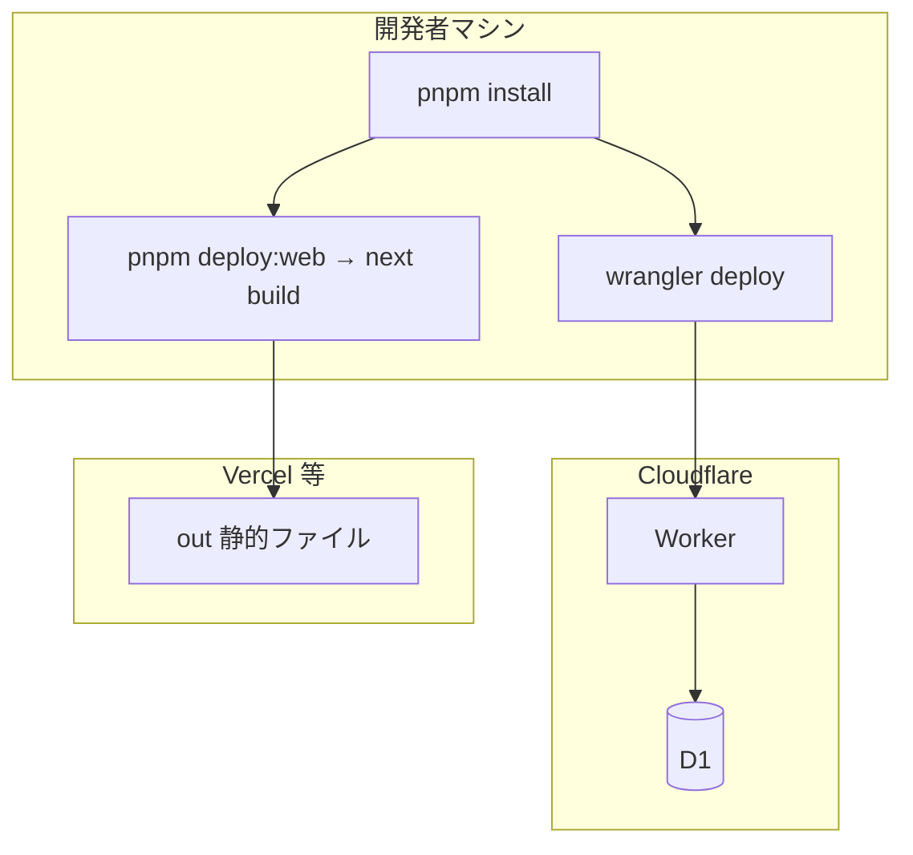

# LINE Harness 技術仕様書

## 1. 文書の目的

システムを構成する**技術要素**（言語・フレームワーク・ホスティング・リポジトリ構成）を一覧化します。

---

## 2. 技術スタック一覧

| 層 | 採用技術 | 役割 |
|----|-----------|------|
| 管理 UI | **Next.js 15**（App Router）、React 19、Tailwind CSS 4 | 静的エクスポート（`output: 'export'`）でホスティング可能 |
| API / Webhook | **Cloudflare Workers**、**Hono** | REST API、LINE Webhook、短縮リンク `/r/:ref` など |
| DB | **Cloudflare D1**（SQLite 互換） | 永続データ |
| パッケージ管理 | **pnpm** ワークスペース | モノレポ |
| 共有型・定数 | `packages/shared` | TypeScript 型定義 |
| LINE API ラッパ | `packages/line-sdk` | Messaging API 呼び出し |
| LIFF フォーム等 | `apps/liff`（Vite 6 + TypeScript） | LINE 内ブラウザ向け画面 |

---

## 3. リポジトリ構成（ディレクトリの意味）

```
（リポジトリルート）
├── apps/
│   ├── web/          ← 管理画面（Next.js）
│   ├── worker/       ← API + Webhook（Workers）
│   └── liff/         ← LIFF 用フロント（Vite）
├── packages/
│   ├── db/           ← SQL スキーマ・マイグレーション・DB アクセス関数
│   ├── shared/       ← 型・共通定義
│   ├── line-sdk/     ← LINE API
│   └── sdk/          ← 外部向け TypeScript SDK（任意利用）
├── 各種仕様書/       ← 本ドキュメント群
├── package.json      ← ルートスクリプト（pnpm -r build 等）
├── pnpm-workspace.yaml
├── vercel.json       ← Vercel デプロイ時の outputDirectory 等
└── apps/worker/wrangler.toml  ← Worker 名・D1 バインド・Cron
```

---

## 4. ビルド・デプロイの流れ（技術的）



- **Worker**: `apps/worker` で `wrangler deploy`。シークレット（`API_KEY` 等）は `wrangler secret put`。
- **管理画面**: `NEXT_PUBLIC_API_URL` に Worker の公開 URL を設定してビルド。Vercel では `vercel.json` で `apps/web/out` を出力ディレクトリに指定する例あり。

---

## 5. 定期処理（Cron）

`wrangler.toml` の `[triggers] crons` で、例として **5 分ごと**に Worker が起動し、ステップ配信・予約一斉配信・リマインダ・BAN 監視などのバッチ処理を実行する設計です（実装は `apps/worker/src/services/`）。

---

## 6. 環境変数（代表例）

| 変数 | 置き場所の例 | 意味 |
|------|----------------|------|
| `API_KEY` | Worker シークレット | 管理画面・外部クライアントが API を呼ぶときの Bearer トークン |
| `LINE_CHANNEL_SECRET` / `LINE_CHANNEL_ACCESS_TOKEN` | Worker | 既定チャネル（レガシー／単一チャネル構成） |
| `NEXT_PUBLIC_API_URL` | 管理画面ビルド時 | ブラウザが呼ぶ API のベース URL |
| `NEXT_PUBLIC_API_KEY` | 任意（開発用） | ログインを省略して開発するとき |

完全な例はリポジトリの `.env.example` を参照してください。

---

## 7. 関連文書

- 手順の詳細: [08-インストール解説書](./08-インストール解説書.md)
- API 一覧: [07-API仕様書](./07-API仕様書.md)
- Worker 内部: [05-バックエンド仕様書](./05-バックエンド仕様書.md)
