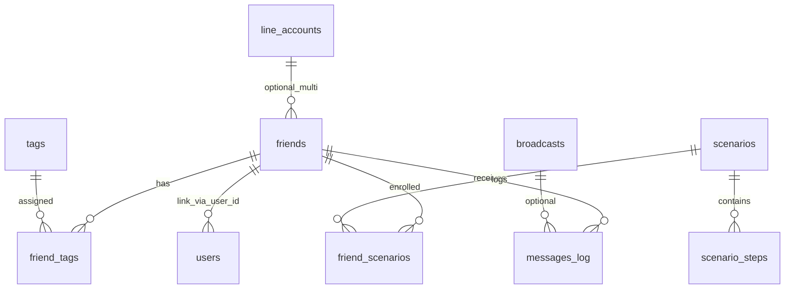

# LINE Harness DB 仕様書

## 1. 文書の目的

データが **どのテーブルに保存され、どう関係するか** を初心者向けに説明します。物理名・カラムの詳細は `packages/db/schema.sql` が正本です。

---

## 2. DB 製品

| 項目 | 内容 |
|------|------|
| 製品 | **Cloudflare D1**（SQLite 互換） |
| ID の型 | 多くは **TEXT**（アプリが `crypto.randomUUID()` 等で生成） |
| 時刻 | **TEXT**（ISO 8601 風。スキーマでは JST オフセット付きの `strftime` を使用） |
| 真偽・フラグ | **INTEGER**（0/1） |

---

## 3. ER 図（主要テーブル・概念）

**読み方**

- **friends** … 1 人の「LINE 上の友だち」。
- **tags / friend_tags** … タグ定義と、友だちとの多対多。
- **scenarios / scenario_steps** … ステップ配信のシナリオと各ステップ。
- **friend_scenarios** … どの友だちがどのシナリオの何ステップ目か、次回送信予定など。
- **line_accounts** … マルチチャネル運用時の公式アカウント情報（トークン等は暗号化されず保存されるため運用に注意）。

---

## 4. テーブル分類リスト

### 4.1 コア（MVP 相当）

| テーブル | 役割 |
|-----------|------|
| friends | LINE ユーザー情報、スコア、`user_id`（内部 UUID ユーザーとのリンク）、`line_account_id`（マルチアカウント） |
| tags | タグマスタ |
| friend_tags | 友だちとタグの関連 |
| scenarios | シナリオ定義・トリガー種別 |
| scenario_steps | 各ステップの遅延・メッセージ |
| friend_scenarios | エンロール状態・次回配信時刻 |
| broadcasts | 一斉配信 |
| messages_log | 送受信ログ |
| auto_replies | キーワード自動返信 |
| admin_users | （スキーマ上）メール／パスワード管理用。現行管理画面は API キー認証が主 |

### 4.2 Round 2（マルチアカウント・計測）

| テーブル | 役割 |
|-----------|------|
| users | クロスチャネル用内部ユーザー |
| line_accounts | チャネル ID・トークン・シークレット |
| conversion_points / conversion_events | CV 定義とイベント |
| affiliates / affiliate_clicks | アフィリエイト・クリック |

### 4.3 Round 3（拡張機能）

| テーブル | 役割 |
|-----------|------|
| incoming_webhooks / outgoing_webhooks | 外部連携 |
| google_calendar_connections / calendar_bookings | カレンダー予約 |
| reminders / reminder_steps / friend_reminders / friend_reminder_deliveries | リマインダ配信 |
| scoring_rules / friend_scores | スコアリング |
| templates | メッセージテンプレート |
| operators / chats | オペレータチャット |
| notification_rules / notifications | 通知 |
| stripe_events | Stripe イベント記録 |
| account_health_logs / account_migrations | BAN 検知・移行 |
| automations / automation_logs | IF-THEN 風オートメーション |

---

## 5. マイグレーション

初期作成後の変更は `packages/db/migrations/*.sql` にあります。例:

- **008_multi_account.sql** … `friends` や `scenarios` 等に `line_account_id` を追加、LINE Login 用カラムを `line_accounts` に追加。

新規環境では **`schema.sql` を適用したうえで、必要に応じてマイグレーションを順に適用**する運用が安全です（プロジェクトの README / Wiki の手順に従ってください）。

---

## 6. よくある質問

**Q. JSON がそのまま無いテーブルがある？**  
A. オートメーション等、`conditions` や `actions` を **TEXT で JSON 文字列**として持つ列があります。

**Q. 外部キーは？**  
A. SQLite の制約として `REFERENCES` が定義されているものがあります。`ON DELETE CASCADE` 等でカスケード削除の挙動が決まります。

---

## 7. 関連文書

- API との対応: [07-API仕様書](./07-API仕様書.md)
- Worker からの DB アクセス実装: [05-バックエンド仕様書](./05-バックエンド仕様書.md)
