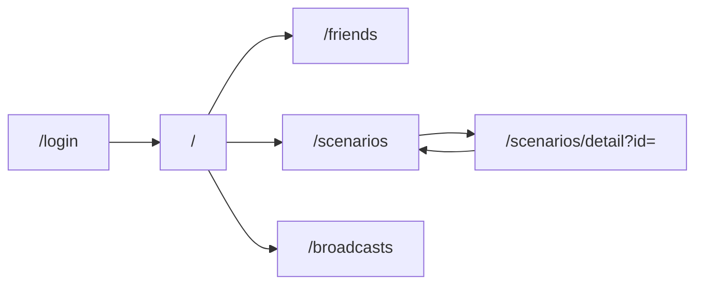

# LINE Harness 画面設計仕様書（フロントエンド / EF）

## 1. 文書の目的

**管理画面**の画面構成・操作の流れ・見た目のイメージを、**画面仕様書（EF: Entry / 操作画面。本書ではフロントエンド UI 全体を指します）** として整理します。実装の正本は `apps/web/src/app/` および `apps/web/src/components/` です。

---

## 2. 全体レイアウト

- **デスクトップ**: 左に固定幅サイドバー（約 256px）、右にメインコンテンツ。
- **モバイル**: 上部にハンバーガーメニュー。タップでサイドバーがスライドイン。
- **ブランド色**: LINE に近い緑 **`#06C755`**（ロゴ「H」アイコン・ active メニュー・主要ボタン）。

```text
┌─────────────────────────────────────────────────────┐
│ [≡]  LINE Harness          ← モバイルのみ固定ヘッダ    │
├──────────────┬──────────────────────────────────────┤
│ [H] LINE     │  ページタイトル（Header）               │
│ Harness      │  ────────────────────────────────────  │
│ 管理画面      │                                        │
│ ──────────── │  メインコンテンツ                        │
│ アカウント切替│  （一覧・フォーム・カード等）             │
│ ──────────── │                                        │
│ メニュー一覧  │                                        │
│ …            │                                        │
│ ログアウト    │                                        │
└──────────────┴──────────────────────────────────────┘
```

---

## 3. ログイン画面（`/login`）

**運用者が最初に見る画面**です。スクリーンショットのイメージは次のとおりです。

### 3.1 画面イメージ（ASCII）

```text
     画面全体：緑背景 #06C755
   ┌─────────────────────────┐
   │      ┌───────────────┐  │
   │      │  [緑角丸 H]    │  │  ← ロゴマーク
   │      │ LINE Harness  │  │
   │      │ 管理画面にログイン │  │  ← サブタイトル
   │      │               │  │
   │      │ API Key       │  │
   │      │ [___________] │  │  ← パスワード型入力
   │      │               │  │
   │      │ [  ログイン  ] │  │  ← 緑ボタン
   │      └───────────────┘  │
   └─────────────────────────┘
        ↑ 白い角丸カード（shadow）
```

### 3.2 操作・挙動

| 要素 | 挙動 |
|------|------|
| API Key 入力 | `type="password"`。未入力時はログインボタン無効。 |
| ログイン | `GET /api/friends/count` に `Authorization: Bearer （入力値）` を付けて成功したらログイン扱い。 |
| 成功後 | `localStorage` に `lh_api_key` を保存し、`/` へ遷移。 |
| 失敗 | 「APIキーが正しくありません」または「接続に失敗しました」。 |

### 3.3 前提

- ブラウザが Worker の URL（`NEXT_PUBLIC_API_URL`）に **CORS でアクセスできる**こと。
- Worker 側の `API_KEY` と、入力した値が **完全一致**すること。

---

## 4. 画面一覧（ルートとメニュー対応）

サイドバー定義は `apps/web/src/components/layout/sidebar.tsx` の `menuSections` と一致します。

| パス | メニュー名 | ざっくり内容 |
|------|------------|----------------|
| `/` | ダッシュボード | **本リポジトリでは** `page.tsx` の実装が `/accounts` と同系の「LINE アカウント一覧」になっている場合があります。独立したダッシュボードにしたい場合は `apps/web/src/app/page.tsx` を編集してください。 |
| `/friends` | 友だち管理 | 一覧・タグ絞り込み・タグ操作 |
| `/chats` | 個別チャット | オペレータチャット |
| `/scenarios` | シナリオ配信 | 一覧・新規作成。詳細編集は `/scenarios/detail?id=` |
| `/broadcasts` | 一斉配信 | 作成・予約・送信 |
| `/templates` | テンプレート | メッセージテンプレ管理 |
| `/reminders` | リマインダ | リマインダ設定 |
| `/affiliates` | 流入経路 | アフィリエイト・経路 |
| `/conversions` | CV計測 | コンバージョンポイント |
| `/scoring` | スコアリング | ルール・スコア |
| `/form-submissions` | フォーム回答 | フォーム送信結果 |
| `/automations` | オートメーション | 自動化ルール |
| `/webhooks` | Webhook | 入出力 Webhook |
| `/notifications` | 通知 | 通知ルール・履歴 |
| `/accounts` | LINEアカウント | マルチチャネル登録 |
| `/users` | UUID管理 | 内部ユーザーと友だちリンク |
| `/health` | BAN検知 | アカウントヘルス |
| `/emergency` | 緊急コントロール | 一括停止など |
| `/login` | （メニュー外） | ログイン |

---

## 5. 代表的な画面遷移



---

## 6. 共通 UI パターン

| パターン | 説明 |
|----------|------|
| **Header** | 各ページ上部のタイトル行（`Header` コンポーネント）。 |
| **CcPromptButton** | 右下固定の「CCに依頼」。モーダルでプロンプトテンプレをコピー（AI 連携用）。 |
| **アカウント切替** | サイドバー上部。複数 LINE アカウント時に選択。API の `lineAccountId` クエリに反映。 |
| **ログアウト** | `lh_api_key` 削除して `/login` へ。 |

---

## 7. アクセシビリティ・モバイル

- タップ領域は概ね **44px 以上**を意識（ボタン・メニュー）。
- サイドバーは `aria-label` をハンバーガー等に付与。

---

## 8. 関連文書

- API とのデータのやりとり: [07-API仕様書](./07-API仕様書.md)
- システム全体像: [01-システム仕様書](./01-システム仕様書.md)
