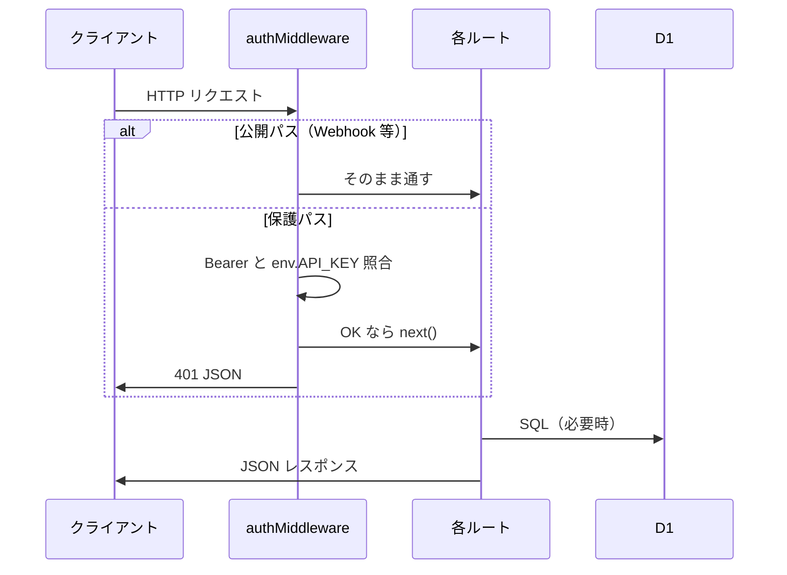

# LINE Harness バックエンド仕様書

## 1. 文書の目的

**Cloudflare Workers 上の Hono アプリケーション**（`apps/worker`）の役割・処理の流れ・主要モジュールを説明します。

---

## 2. 実行環境

| 項目 | 内容 |
|------|------|
| ランタイム | Cloudflare Workers |
| フレームワーク | Hono |
| エントリ | `apps/worker/src/index.ts` |
| 設定 | `apps/worker/wrangler.toml`（D1 バインド名 `DB`、Cron トリガー） |

---

## 3. リクエスト処理の流れ



---

## 4. 認証ミドルウェア（概要）

`apps/worker/src/middleware/auth.ts` で、次のパスは **API キー不要**（別方式または公開）として除外されます。

- `/webhook` … LINE 署名検証
- `/docs` / `/openapi.json` … ドキュメント
- `/r/*` … 短縮ランディング
- `/t/*` … トラッキングリンク系
- `/api/liff/*` … LIFF 連携
- `/auth/*` … LINE ログイン／友だち追加導線
- Stripe Webhook、受信 Webhook、フォーム submit 等（パスパターンはソース参照）

それ以外は **`Authorization: Bearer （API_KEY と一致）`** が必須です。

---

## 5. ルートモジュール一覧

`index.ts` で `app.route('/', ...)` としてマウントされています。

| モジュール | 主な責務 |
|------------|-----------|
| `webhook` | LINE Webhook、友だち登録、メッセージ受信 |
| `friends` / `tags` / `scenarios` / `broadcasts` | CRM・配信の CRUD |
| `users` / `lineAccounts` | 内部ユーザー・マルチ LINE アカウント |
| `conversions` / `affiliates` | CV・アフィリエイト |
| `openapi` | OpenAPI JSON / Swagger UI 用 |
| `liffRoutes` | LIFF 用 API |
| `webhooks`（routes） | 外部 Webhook IN/OUT |
| `calendar` | Google カレンダー |
| `reminders` / `scoring` / `templates` | リマインダ・スコア・テンプレ |
| `chats` | オペレータチャット |
| `notifications` | 通知 |
| `stripe` | Stripe |
| `health` | BAN 検知・ヘルス |
| `automations` | オートメーション |
| `richMenus` / `trackedLinks` / `forms` | リッチメニュー・短縮リンク・フォーム |

---

## 6. バックグラウンド処理（サービス層）

`apps/worker/src/services/` に、Cron や Webhook から呼ばれる処理があります。

| サービス（例） | 役割 |
|------------------|------|
| `step-delivery` | シナリオのステップ配信スケジュール実行 |
| `broadcast` | 予約一斉配信の送信 |
| `reminder-delivery` | リマインダ送信 |
| `ban-monitor` | アカウントヘルスチェック |
| `segment-send` / `segment-query` | セグメント配信関連 |
| 他 | イベントバス、ステルス送信用など |

---

## 7. レスポンス形式の慣習

多くの API で JSON ボディが次の形です。

```json
{ "success": true, "data": { } }
```

エラー時:

```json
{ "success": false, "error": "メッセージ" }
```

---

## 8. 関連文書

- エンドポイント一覧: [07-API仕様書](./07-API仕様書.md)
- LINE との境界: [06-連携仕様書](./06-連携仕様書.md)
- テーブル定義: [03-DB仕様書](./03-DB仕様書.md)
