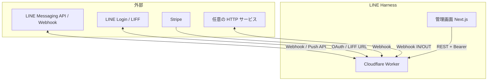

# LINE Harness 連携仕様書

## 1. 文書の目的

本システムが **外部とどうつながるか**（LINE、管理画面、決済、Webhook 等）を整理します。

---

## 2. 連携一覧

---

## 3. LINE 公式アカウント（Messaging API）

| 項目 | 内容 |
|------|------|
| 受信 | LINE から **Webhook** で Worker の `/webhook`（実装は `routes/webhook`）へ POST |
| 署名 | `LINE_CHANNEL_SECRET` を用いた **X-Line-Signature** 検証 |
| 送信 | `LINE_CHANNEL_ACCESS_TOKEN`（環境変数）または **`line_accounts` テーブル**のトークンで Messaging API を呼び出し |
| マルチアカウント | 友だち・シナリオ等に `line_account_id` を紐付け、Webhook のチャネルでルーティング |

**運用者がすること**

1. LINE Developers でチャネル作成、Webhook URL に Worker URL を設定。
2. チャネルシークレット・アクセストークンを Worker の環境または DB に設定。

---

## 4. LINE Login / LIFF

| 項目 | 内容 |
|------|------|
| 用途 | 友だち追加導線（`/auth/line`）、フォーム・予約など LIFF 内画面 |
| Worker | `/auth/*`、`/api/liff/*` 等（認証ミドルウェアで一部公開） |
| LIFF アプリ | `apps/liff` をビルドし、LINE Developers の LIFF URL にデプロイした URL を設定 |

環境変数例: `LIFF_URL`、`LINE_CHANNEL_ID`、`LINE_LOGIN_CHANNEL_ID` / `LINE_LOGIN_CHANNEL_SECRET`（`index.ts` の `Env` 型参照）。

---

## 5. 管理画面（Next.js）との連携

| 項目 | 内容 |
|------|------|
| プロトコル | HTTPS |
| 認証 | ブラウザから `Authorization: Bearer API_KEY` |
| 設定 | ビルド時 `NEXT_PUBLIC_API_URL` = Worker のオリジン |
| CORS | Worker 側で `cors({ origin: '*' })`（MVP 向け。本番は限定推奨） |

---

## 6. Stripe

| 項目 | 内容 |
|------|------|
| 受信 | `/api/integrations/stripe/webhook`（署名検証は Stripe 仕様に従う実装を確認） |
| 記録 | `stripe_events` テーブル |

---

## 7. Webhook IN / OUT（カスタム連携）

| 種別 | 説明 |
|------|------|
| Incoming | 外部から特定 URL へ POST し、Worker がイベント処理（ルールは DB・ルート実装参照） |
| Outgoing | 本システム内のイベントで、登録した URL へ HTTP 通知 |

設定は管理画面「Webhook」、データは `incoming_webhooks` / `outgoing_webhooks`。

---

## 8. 短縮リンク・トラッキング

| パス | 用途 |
|------|------|
| `/r/:ref` | ランディング HTML を返し、LIFF 等へ誘導（`ref` パラメータで流入記録に利用可能） |
| `/t/...` | トラッキングリンク（クリック計測・タグ付け等。実装は `tracked-links` ルート） |

---

## 9. Google Calendar

接続情報は `google_calendar_connections`、予約は `calendar_bookings`。トークン保管の扱いはセキュリティポリシーに注意してください。

---

## 10. 関連文書

- API 詳細: [07-API仕様書](./07-API仕様書.md)
- デプロイ手順: [08-インストール解説書](./08-インストール解説書.md)
