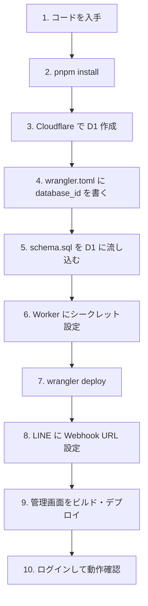

# LINE Harness インストール解説書（初心者向け）

## 1. 文書の目的

**自分用の LINE Harness を動かす**までの流れを、順番に追えるようにします。コマンドは Windows（PowerShell）でも macOS / Linux でも、同様のツールが入っていれば概ね同じです。

---

## 2. 必要なもの（事前準備）

| もの | 用途 |
|------|------|
| **Node.js 20 以上** | `pnpm`・ビルド用 |
| **pnpm** | パッケージ管理（Corepack または `npm i -g pnpm`） |
| **Git** | リポジトリの取得 |
| **Cloudflare アカウント** | Worker と D1 |
| **LINE Developers アカウント** | Messaging API チャネル |
| （任意）**Vercel アカウント** | 管理画面のホスティング |

---

## 3. 全体の流れ（イメージ）



---

## 4. 手順（詳細）

### 4.1 コードを入手

```bash
git clone https://github.com/（あなたのリポジトリ）/Line-Herness.git
cd Line-Herness
```

（フォルダ名は環境に合わせてください。）

### 4.2 依存関係のインストール

```bash
pnpm install
```

ルートで実行すると、ワークスペース全体がインストールされます。

### 4.3 Cloudflare D1 の作成

```bash
cd apps/worker
npx wrangler login
npx wrangler d1 create line-crm
```

表示された **database_id** をコピーします。

### 4.4 wrangler.toml の更新

`apps/worker/wrangler.toml` の `database_id = "YOUR_D1_DATABASE_ID"` を、コピーした ID に置き換えます。

### 4.5 スキーマの適用

リポジトリルートから（パスに注意）:

```bash
npx wrangler d1 execute line-crm --remote --file=packages/db/schema.sql
```

ローカル検証だけなら `--local` を使う手もあります。  
追加マイグレーションがある場合は `packages/db/migrations/` の順序に従い、プロジェクト Wiki や README を参照してください。

### 4.6 Worker のシークレット

```bash
cd apps/worker
npx wrangler secret put API_KEY
npx wrangler secret put LINE_CHANNEL_SECRET
npx wrangler secret put LINE_CHANNEL_ACCESS_TOKEN
```

- **API_KEY**: 長いランダム文字列（例: 32 文字以上）を自分で決める。
- **LINE_*:** LINE Developers のチャネルからコピー。

マルチアカウントのみ運用する場合でも、既存コードでは環境変数のチャネルが参照される箇所があるため、**最初は両方設定**しておくのが安全です。

### 4.7 Worker のデプロイ

```bash
cd apps/worker
npx wrangler deploy
```

表示された URL（例: `https://xxxx.workers.dev`）をメモします。

### 4.8 LINE Developers の設定

1. Messaging API の **Webhook URL** に `https://（Worker）/webhook` を設定。
2. Webhook の利用を有効化。
3. **応答メッセージ**は必要に応じてオフ（ボット側で処理するため）。

### 4.9 管理画面（Vercel の例）

1. Vercel で Git リポジトリをインポート。
2. 環境変数 **`NEXT_PUBLIC_API_URL`** に Worker の URL（末尾スラッシュなし推奨）を設定。
3. ビルドはリポジトリの `vercel.json` に従い、`pnpm install` → `pnpm deploy:web` → 出力 `apps/web/out` の構成になっています。

デプロイ後、ブラウザで **`https://（Vercelのドメイン）/login`** を開きます。

### 4.10 ログイン

1. 画面に **API Key** を入力（手順 4.6 で `wrangler secret put` した値と同じ）。
2. 「ログイン」を押すと、`/api/friends/count` が成功した場合にトップへ進みます。

---

## 5. ローカルだけで試す（開発者向け）

| 役割 | コマンド例 |
|------|-------------|
| Worker | `cd apps/worker && pnpm dev`（Wrangler dev。ポートは表示に従う） |
| 管理画面 | `cd apps/web && pnpm dev`（通常 3001） |

管理画面の `.env.local` 等で `NEXT_PUBLIC_API_URL=http://127.0.0.1:8787` のようにローカル Worker を指すと、ブラウザから繋げます。

---

## 6. うまくいかないとき

| 症状 | 確認すること |
|------|----------------|
| ログインで「接続に失敗」 | `NEXT_PUBLIC_API_URL` がビルド時に正しいか。CORS。Worker が起動しているか。 |
| 401 Unauthorized | API キーが Worker の `API_KEY` と一致しているか。Bearer 形式か。 |
| Webhook 400/403 | チャネルシークレットが環境と LINE コンソールで一致しているか。 |
| D1 エラー | `database_id`・DB 名・`schema.sql` 適用済みか。 |

---

## 7. 関連文書

- 画面の見方: [04-画面設計仕様書（フロントエンド）](./04-画面設計仕様書（フロントエンド）.md)
- API の詳細: [07-API仕様書](./07-API仕様書.md)
- アーキテクチャ: [02-技術仕様書](./02-技術仕様書.md)
